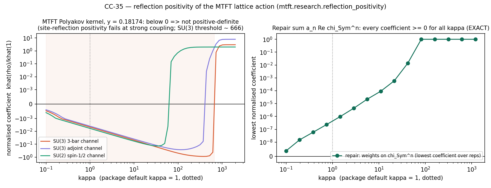

# CC-35 — reflection positivity of the MTFT lattice action (Paper 13 §4.2, Paper 24 Thm 2.4, Paper 5 Thm 7.8, `lattice.py`) — RETRACTION OF "PROVEN"

## What the papers and the package state
- `lattice.py`: "Reflection positivity (OS2) proven via Osterwalder-Seiler (Paper 24)"; "μ_N(y) > 0 unconditionally → nonperturbative mass gap".
- Paper 13 §4.2: "c_n ≥ 0 makes each factor exp(c_n Re Tr(Pⁿ)) positive-definite as a class function".
- Paper 24, Theorem 2.4 and Step 4: reflection positivity of the MTFT action by an Osterwalder–Seiler argument in which "the weights w_n/g² ≥ 0
  ensure each term in the n-sum preserves positive-definiteness"; the abstract says RP is proved, and also that it holds "under a specific condition".
- Paper 5, Theorem 7.8 and the Dictionary (Paper 24: "reflection positivity proven"; Paper 5: "Stiffness μ_N(y)" as the mass gap).

## Findings (`mtft.research.reflection_positivity`, `tests/test_cc35.py`; every number reproducible)
1. **The lemma is false for n ≥ 2 (EXACT).** Tr Uⁿ is the power sum pₙ, a virtual character: pₙ = Σₖ (−1)ᵏ s_{(n−k,1ᵏ)} (Murnaghan–Nakayama).
   On SU(3): Tr U² = χ₆ − χ_3̄, Tr U³ = χ₁₀ − χ₈ + 1, Tr U⁴ = χ₁₅′ − χ₁₅ + χ₃; on SU(2): Tr U³ = χ_{3/2} − χ_{1/2}. So exp(c Re Tr Uⁿ) with c > 0
   has negative character coefficients at small c and is not positive-definite. This is the Adams operation ψⁿ (the same identity that fixes
   tr_{Λ²}F⁵ in `anomaly8d`).
2. **Nothing compensates, because w₁ = 0 (EXACT).** exp(Σ hⁿpₙ/n) = Σ hᵏ χ_{Symᵏ} is positive-definite only through the n = 1 term; log 1 = 0 removes
   it. First-order coefficients per unit κ: SU(3) 3̄: (a₄ − a₂)/6 (< 0 for y > ln√2/2π = 0.0552); SU(3) adjoint: −a₃/3; SU(2) spin ½: −a₃/2 (< 0 for all y).
3. **Counterexample at the package defaults (EXACT at first order, NUMERICAL beyond).** With the papers' site reflection Θ(x₀, x) = (−x₀, x) and
   F a matrix element of the positive-half Polyakov line in the representation ρ, at β = 0 the measure factorises over spatial sites and
   ⟨(ΘF)* F⟩/Z = k̂(ρ̄)/(d_ρ² k̂(1)). At κ = 1, y = 0.18174: k̂/k̂(1) = −0.004698 (SU(3) 3̄), −0.003969 (SU(3) adjoint), −0.005944 (SU(2) spin ½);
   the pairing is −6.2 × 10⁻⁵ for the SU(3) adjoint. By continuity it stays negative for small β > 0. **Site-reflection positivity, as the
   papers define it, fails.** Negative for every y tested at κ = 1 (0.05 → 1.0).
4. **Where positivity returns (NUMERICAL, truncated).** Over SU(3) representations with l₁ + l₂ ≤ 10 the kernel is positive-definite only for
   κ ≳ 666 at y_c; over SU(2) spins ≤ 8, for κ ≳ 59.2.
5. **Not decided (OPEN).** Link reflections — the ones that build the transfer matrix: at β = 0 the two crossing links are Haar-free inside P and
   erase the coupling (kernel = k̂(1)); at β > 0 the status is open. Positivity restricted to gauge-invariant functions is open. Paper 24's
   Step 3 treats n × 1 rectangles (a different action); rectangles crossing the plane off-centre are not of the form A Θ(A)† and are not covered
   by the argument as written. A positive transfer matrix is therefore not ruled out — it is unproven.
6. **Two structural corrections recorded with it.** (a) μ_N(y) = minₘ Σ n² aₙ (1 − cos 2πnm/N) is the curvature of the classical Polyakov potential
   at the centre-symmetric point — a stiffness, not a spectral gap; "mass gap" attached to μ_N anywhere in the package is historical wording.
   (b) The Polyakov term singles out time and needs a compact time circle, so the action is not O(4)/hypercubic invariant; OS1 in the continuum
   requires the term to become irrelevant, in which case it cannot supply the gap.

## Repair (EXACT)
k_sym(U) = exp((κ/N) Σ aₙ Re χ_{Symⁿ}(U)) is positive-definite for every κ ≥ 0 (positive-type class functions are closed under sums, products and
exponentials); `kernel_coefficients(..., weights="sym")` confirms it numerically (lowest coefficient ≥ 0 across κ = 0.01 … 1000). Placing the tower on
plaquettes, Σ aₙ Re χ_{Symⁿ}(U_□), restores hypercubic symmetry and falls under Osterwalder–Seiler. Cost: the eigenphase potential changes, so μ_N,
the Hessian eigenvalues and the spectral lock at y_c must be recomputed for the repaired action. Universality then predicts the same continuum
Yang–Mills: the arithmetic tower can shape the lattice road but cannot by itself supply the continuum gap.

## Package changes (this correction)
`lattice.py` module docstring and `mass_gap_bound` docstring; `arithmetic.py` (μ_N labelled a stiffness); `tower.py`; `quantum.py`; Legend entries
`mu_stiffness`, `filtered_moment_identity` (annotated) and `cc35_reflection_positivity` (new). Function names are unchanged (API stability).

## Papers flagged (text to be corrected in the next paper revision)
Paper 13 §4.2 (the lemma); Paper 24 abstract, Theorem 2.4 and Steps 3–4, Theorem 2.5's "Status: PROVEN" (it follows from 2.4); Paper 5 Theorem 7.8
(wording: stiffness, not mass gap); the Dictionary's Paper 24 line. Paper 13 §§6–8 (one-link concentration and the Poincaré/log-Sobolev blueprint)
were not audited here; they are fixed-spacing statements and inherit the need for RP before any OS reconstruction.

## Proposed register text
"Reflection positivity of the MTFT lattice action is retracted from PROVEN to OPEN. The lemma used for the Polyakov term (exp(c Re Tr Pⁿ) positive-definite
for c ≥ 0) is false for n ≥ 2 because power sums are virtual characters; with w₁ = 0 no term compensates. In the papers' site-reflection sense RP fails
at strong coupling at the default parameters. μ_N(y) is the classical stiffness of the Polyakov potential, not a spectral gap. A character-based
repair is exact and available. None of this touches the arithmetic layer."

## What would upgrade it
RP proved for link reflections at physical β for the current action, or adoption of the character repair with μ_N and y_c recomputed; then the
programme's position relative to the Clay problem is that of any reflection-positive lattice action: the continuum limit with a uniform gap is open.
