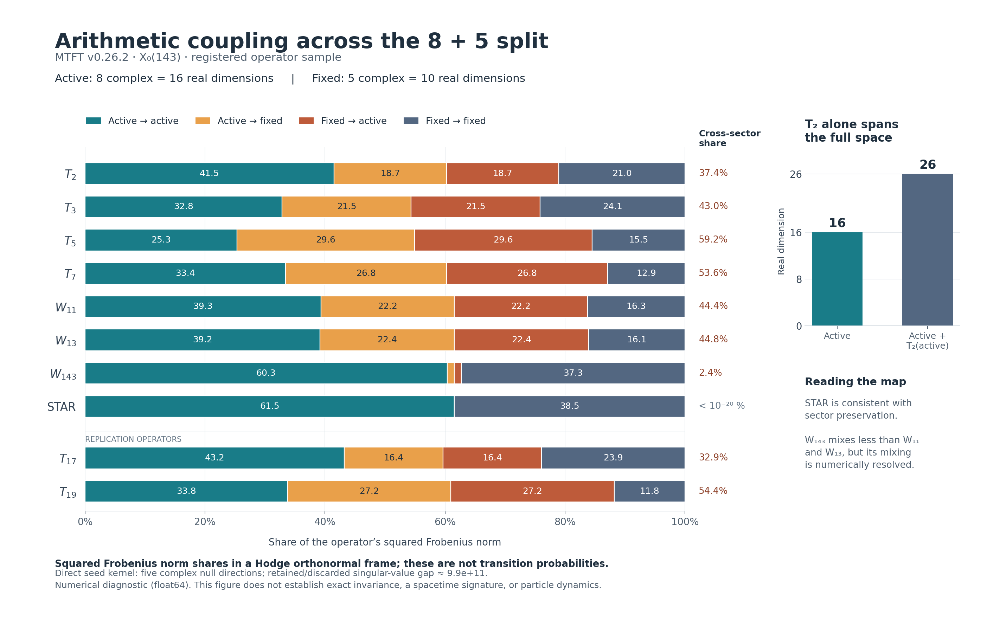

# MTFT: arithmetic coupling of the active eight

**8 September 2026 · supplied release 0.26.2 · bounded research study**

The active eight-dimensional complex sector is reproducible, but it is not
invariant under any of the tested good Hecke or Atkin–Lehner operators. STAR
preserves it. Applying T2 to the active sector already expands its span to
all 26 real homology dimensions. Consequently, a construction that treats
this eight as an isolated module for those arithmetic operators is not
supported by the measurements.

A separate exact rank argument explains why the chosen local-channel
construction has at least five complex kernel directions. The numerical
8+5 split saturates that bound. This provides a simpler route to the
projector and separates its existence from the numerical D4 fingerprint.

## 1. What was fixed and what was measured

The protocol fixed the release, its triangle choices (1,11,12), the primary
operators T2,T3,T5,T7,W11,W13,W143,STAR, and replication operators T17,T19.
We used three coordinate seeds and period-input precision 50/80. Matrix
arithmetic throughout remained NumPy float64/complex128.

Before coupling results were read, a source inspection clarified two kinds
of channel: the three returned B_i encode antilinear maps z -> B_i conjugate(z).
The three linear Lie seeds are C_ij=B_i conjugate(B_j)-B_j conjugate(B_i).
The primary active projector was reconstructed directly from the common
kernel of these C_ij, independently of numerical Lie closure. Amendment A in
`PROTOCOL.md` records the distinction.

All arithmetic operators were transported into the same Hodge-orthonormal
real frame. The eight-dimensional complex active space has real dimension
16; the five complex singlets have real dimension 10. The singlet label
refers to the selected Lie algebra. It does not mean that arithmetic must
act trivially on these directions.

Let P project onto the active space and Q=I-P. We recorded all four blocks
PAP, PAQ, QAP, QAQ. The table's leakage is

\[
\ell(A)=\frac{\|QAP\|_F}{\|A\|_F}.
\]

This is a dimensionless matrix-norm diagnostic, not a transition
probability. The final column adds the squared fractions of both
off-diagonal blocks. All norms refer to the declared metric; they are
unchanged by orthonormal coordinate transformations. The tested operators
are selfadjoint in this metric, so opposite coupling blocks have equal
norms, a consistency check rather than two independent observations.

## 2. Arithmetic coupling map

| Operator | Active-to-fixed leakage ell(A) | Both cross-sector blocks: share of squared norm |
|---|---:|---:|
| T2 | 0.432668 | 37.44% |
| T3 | 0.463898 | 43.04% |
| T5 | 0.543903 | 59.17% |
| T7 | 0.517921 | 53.65% |
| W11 | 0.471264 | 44.42% |
| W13 | 0.473161 | 44.78% |
| W143 | 0.109154 | 2.38% |
| STAR | 8.51e-14 | approximately zero |
| T17, replication | 0.405583 | 32.90% |
| T19, replication | 0.521585 | 54.41% |

The frozen diagnostic gates classified <=1e-8 as consistent with preservation
and >=1e-6 as resolved mixing. Every non-STAR entry is far above the mixing
threshold. W143 couples the sectors much less than W11 or W13 under this
metric, but its coupling remains clearly nonzero. This comparison was not
used to introduce a new pass threshold or identify a physical symmetry.

The earlier audit's failure of Atkin–Lehner operators to normalize the D4
algebra did not settle this subspace question. This study measures the
subspace question directly and reaches a separate negative result.

## 3. T2 already generates the whole homology from the active sector

Let U be an orthonormal real basis of the active space. The augmented matrix
[U,T2 U/||T2||_F] has rank 26. Its smallest singular value divided by its
largest is 0.00971049, comfortably separated from the registered 1e-7 rank
threshold. Thus the rank is not inferred from tiny numerical remnants.

| Arithmetic generators | Real span growth |
|---|---|
| T2 alone | 16 -> 26 -> 26 |
| T2,T3,T5,T7 | 16 -> 26 -> 26 |
| W11,W13,W143 | 16 -> 26 -> 26 |
| Entire primary set | 16 -> 26 -> 26 |

The independent localized-support projector reproduces the T2 rank and its
smallest normalized singular value. Once the span is the whole space,
terminal leakage at around 1e-15 is an identity/control consequence, not
additional evidence about a smaller invariant sector.

This does not say that the full Hecke representation is irreducible: it
already has its known arithmetic block decomposition. It says that the
particular active subspace selected by these local channels intersects the
arithmetic directions sufficiently that T2 and the starting subspace span
the whole homology.

## 4. Why eight active and five inactive directions appear

The selected triangles touch eight edges. Their columns in the exact
rational harmonic matrix have rank four, with a stored nonzero minor and
exact reconstruction certificate. This rank fact is independent of period
evaluation and numerical Lie closure.

For general genus g and localized harmonic support rank r, the construction's
two projections—Hodge selfadjoint part and J-antilinear part—place all channel
images inside a real subspace of dimension at most 4r. Its orthogonal
complement is J-stable and annihilated by every channel. Therefore the
common kernel has complex dimension at least max(0,g-2r).

Here g=13 and r=4, giving at least **five complex kernel directions**. We
derived this elementary bound explicitly in `LOCALIZATION_RANK_LEMMA.md`.
Numerically the successive real spans have ranks 4,8,16, and the final
projector matches the direct C_ij projector within 4.90e-13. The span matrix
has condition number approximately 65.25, making it a useful practical
alternative to extracting the module from a Lie closure.

The bound does not prove D4, triality, or a physical identification. It
explains why this localized construction cannot activate more than eight
complex directions. Saturation to exactly eight remains a numerical result
with the supplied period data.

## 5. Real structure and numerical stability

STAR is an antilinear isometric involution: STAR^2=I, STAR J=-J STAR, with
relative defects below 9e-15. It preserves the split. On the active real
16-dimensional space its +1 and -1 eigenspaces each have dimension eight;
on the complementary real 10-dimensional space each has dimension five.
These are eigenspaces of conjugation, not signs of a spacetime metric.
Part of STAR preservation follows from the STAR-fixed construction and is
treated as structural consistency, not an independent discovery.

Across the registered coordinate seeds, the transported active projectors
differ by at most 5.09e-13, while block norm fractions differ by at most
3.04e-14. Raising the period-input precision to 80 leaves the coupling
fractions unchanged at the recorded double precision. This is a stability
check, not a high-precision matrix computation or certified error enclosure.

An implementation limitation was exposed: the package's numerical Lie
closure passes at seed 143, but raises `LieGateAmbiguous` at seeds 2026 and
31415. Its rejected residuals are respectively 1.20765e-7 and 1.58449e-7,
inside the registered ambiguity band (1e-7,1e-5]. The initial runner stopped;
it was amended to record this outcome and continue the independent module
measurements. No tolerance was relaxed and no release source was changed.
We do not claim to have reproduced the D4 closure certificate in those two
frames. The directly reconstructed module and the coupling results are
stable without those closure certificates.

Independent verification using the localization projector reproduces all ten
coupling measurements within 1.09e-13. For the nine mixing operators the
maximum discrepancy is 1.70e-14. Its STAR leakage is around 8.4e-15, also
consistent with preservation.

## 6. Exploratory consequence: compression can create apparent noncommutativity

After the primary mixing result, we tested a potential interpretation hazard.
Exact rational arithmetic verifies [T2,T3]=0 and [T2,W11]=0 on the full space.
After compression to the active sector, both pairs have nonzero commutators:
normalized values are approximately 0.178337 and 0.142436 in the independent
check's stated convention.

For commuting A,B and Q=I-UU^T, the exact identity is

\[
[U^T A U,U^T B U]=U^T(BQA-AQB)U.
\]

The numerical residual in this identity is below 8.21e-15. Thus the apparent
noncommutativity is accounted for by omitted coupling through the complement.
The compressed matrices do not represent the original commuting Hecke
algebra. This check is exploratory and carries no weight in the frozen
primary decisions; it illustrates why the discarded five directions matter.

## 7. What this changes in the research plan

The result supports studying the full arithmetic module with its local
8+5 decomposition and explicit coupling blocks. It does not support an
isolated-eight arithmetic interpretation under the tested operators.
Restricting to STAR or another explicitly justified subset would be a
different target and must be stated as such.

The next useful mathematical question is to characterize the coupling maps:
their ranks, singular directions, and relation to the exact Hecke blocks.
A complementary controlled reduction could retain the discarded sector
through a Schur complement once a specific selfadjoint operator is chosen;
such a reduction would be an operator construction, not automatically a
physical Hamiltonian or new interaction.

TH2 can still test theta-gradient support after its frame and error-budget
issues are resolved, but even a favorable support result would not restore
invariance under the tested arithmetic operators. A Clifford construction
must specify its module, real structure, and arithmetic compatibility. The
standard triality framework alone does not select a spacetime signature.
[Baez, Spinors and Trialities](https://math.ucr.edu/home/baez/octonions/node7.html)

## Evidence and reproducibility

- **EXACT:** rank-four harmonic support certificate; the general rank-bound
  proposition under its stated assumptions; the two rational commutation
  checks; the algebraic compression identity.
- **DIAGNOSTIC:** period-dependent projectors, saturated ranks, leakage
  measurements, real-structure checks, and invariant hulls.
- **Not performed:** an exact reconstruction of the Hodge-dependent active
  projector, interval arithmetic, the full package test suite, theta-gradient
  evaluation, a gamma-matrix search, or a Standard Model identification.

The package source is unchanged. The bundle includes the original release,
frozen protocol, scripts, complete numerical ledgers and matrices, exact
support certificate, execution notes, figure, and an end-to-end runner.
