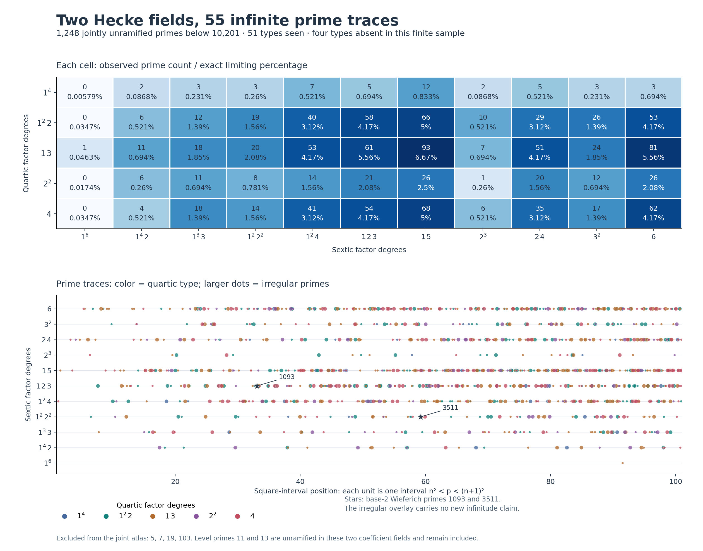
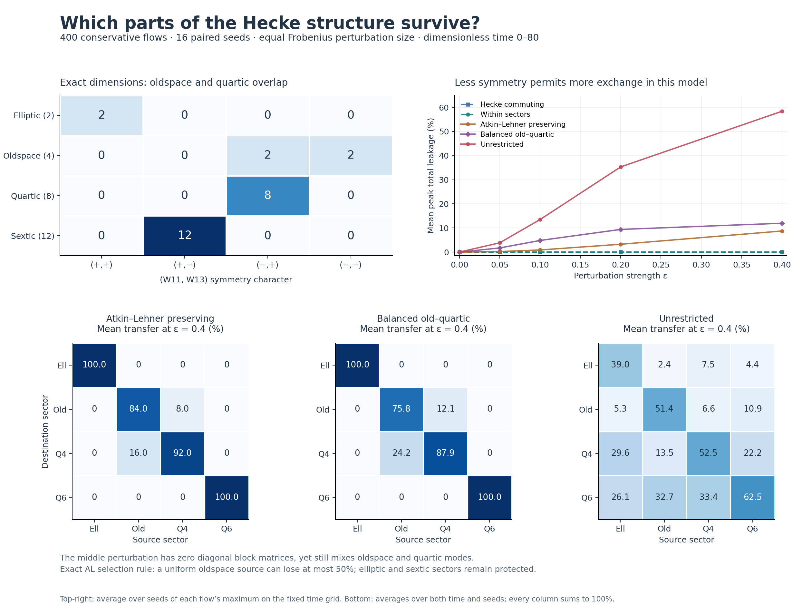

# Hecke fields and sector stability

MTFT 0.26.0 companion experiment · 6 September 2026 · v0.1.0

The experiments give the “tissue” idea two precise forms: an algebraic web of **55 provably infinite prime-splitting classes**, and an exact map of which Hecke sectors can exchange amplitude when some symmetries are preserved. The quartic and sextic splitting fields are linearly disjoint. On X0(143), the oldspace and quartic sector nevertheless share an Atkin–Lehner character, so those involutions alone do not separate all Hecke sectors. These are different relationships: field disjointness concerns arithmetic extensions; sector mixing concerns operators on homology.

## 1. The prime-splitting atlas

**EXACT arithmetic with an accompanying mathematical argument.** The T2 factors are

\[
g_4(x)=x^4-3x^3-x^2+5x+1,
\qquad
h_6(x)=x^6-10x^4+2x^3+24x^2-7x-12.
\]

| Coefficient field | Galois group of its splitting field | Discriminant |
|---|---|---|
| Quartic | S4, order 24 | 1,957 = 19 × 103 |
| Sextic | S6, order 720 | 194,616,205 = 5 × 7 × 5,560,463 |

Both discriminants are squarefree, so they are also the number-field discriminants of the corresponding monogenic fields. The coefficient fields themselves have degrees 4 and 6; the orders 24 and 720 refer to their Galois closures.

The groups were computed with SymPy and independently established from modular factorizations:

| Field | Irreducible reduction | A cycle of length n−1 | A transposition |
|---|---|---|---|
| Quartic | p = 2: (4) | p = 3: (1,3) | p = 43: (1,1,2) |
| Sextic | p = 19: (6) | p = 3: (1,5) | p = 307: (1,1,1,1,2) |

An irreducible reduction makes the group transitive. The long cycle makes a point stabilizer transitive on all the other roots; conjugating a transposition then supplies every transposition. This proves Sn in each case. The reduction-to-cycle theorem and this group criterion are [Milne, Theorem 4.28 and Lemma 4.31](https://www.jmilne.org/math/CourseNotes/FT.pdf). All factor coefficients and independent finite-field irreducibility checks are retained in the certificate.

The ramification supports are disjoint. An intersection of the two Galois closures would therefore be unramified at every finite prime over Q. The Minkowski bound forces that intersection to be Q; see [Sutherland, Corollary 14.27](https://math.mit.edu/classes/18.785/2021fa/LectureNotes14.pdf). Thus the compositum has group S4 × S6 and degree 17,280. An alternative check is that the only possible nontrivial common quotient of S4 and S6 is C2, but their discriminant quadratic fields differ. In particular, the coefficient fields have no shared nontrivial subfield.

For a cycle partition with m_j cycles of length j, the proportion of permutations is

\[
\delta(\lambda)=\frac{1}{\prod_j j^{m_j}m_j!}.
\]

The product group gives joint densities δ(λ4)δ(λ6). Applying the [Chebotarev density theorem](https://math.mit.edu/classes/18.785/2015fa/LectureNotes25.pdf) makes every one of the 5 × 11 = **55** joint types infinite. This is a deduction from exact field structure and a theorem, not an extrapolation from the finite counts.

### Finite census

We factored both polynomials at all **1,252 primes below 10,201**. The joint unramified atlas contains **1,248** primes after excluding **5, 7, 19, 103**. The sextic ramification prime 5,560,463 lies outside the range. The level primes **11 and 13 are retained**: bad reduction of the modular curve and ramification of these coefficient fields are distinct properties.

A partition such as 1+1+2 means two linear factors and one irreducible quadratic. Each marginal below has 1,250 unramified primes. Densities are asymptotic targets; multiplying one by the finite sample size gives a reference count, not a proven finite-sample expectation under independent sampling.

Quartic:

| Factor degrees | Exact density | Count |
|---|---|---:|
| 1+1+1+1 | 1/24 | 45 |
| 1+1+2 | 1/4 | 319 |
| 1+3 | 1/3 | 421 |
| 2+2 | 1/8 | 145 |
| 4 | 1/4 | 320 |

Sextic:

| Factor degrees | Exact density | Count |
|---|---|---:|
| 1+1+1+1+1+1 | 1/720 | 1 |
| 1+1+1+1+2 | 1/48 | 29 |
| 1+1+1+3 | 1/18 | 62 |
| 1+1+2+2 | 1/16 | 64 |
| 1+1+4 | 1/8 | 155 |
| 1+2+3 | 1/6 | 199 |
| 1+5 | 1/5 | 265 |
| 2+2+2 | 1/48 | 26 |
| 2+4 | 1/8 | 140 |
| 3+3 | 1/18 | 82 |
| 6 | 1/6 | 227 |

The sextic completely splits at just **8377** in this sample. No sampled prime completely splits in both fields; that joint class still has positive density **1/17,280**. Exactly **51 of the 55 joint classes** appear. The four missing classes are:

| Quartic type | Sextic type | Proved positive density |
|---|---|---|
| 1+1+1+1 | 1+1+1+1+1+1 | 1/17280 |
| 1+1+2 | 1+1+1+1+1+1 | 1/2880 |
| 2+2 | 1+1+1+1+1+1 | 1/5760 |
| 4 | 1+1+1+1+1+1 | 1/2880 |

This supplies the requested contrast between sparse observations and known infinitude. The atlas preserves the square-interval position and earlier irregularity labels of each prime. For example, **1093** is regular with types (1,1,2) and (1,2,3); **3511** has irregularity index 2 with types (1,1,2) and (1,1,2,2). Both are base-2 Wieferich primes. These two marked examples carry no statistical inference.

The “proved infinite” label belongs to each splitting class. This experiment does **not** establish the infinitude of its intersection with irregular primes, statistical independence of irregularity, or a prime in every square interval. A positive global density gives no such interval guarantee. No post-hoc dependence test was fitted to these labels.

## 2. Symmetry and sector stability

**EXACT sector decomposition.** Rational CRT projectors were constructed from the squarefree minimal polynomial

\[
m(x)=x(x+2)g_4(x)h_6(x).
\]

They were verified to be idempotent, pairwise orthogonal, complete, and equal to the projectors obtained independently from the packaged integral block bases. Their real ranks are 2, 4, 8, 12. The block called “ghost” in the package is the level-11 oldspace, recorded here as “old”; the quartic block is a distinct newform sector.

The simultaneous Atkin–Lehner intersections are:

| Hecke sector | (+,+) | (+,−) | (−,+) | (−,−) | Total |
|---|---:|---:|---:|---:|---:|
| Elliptic | 2 | 0 | 0 | 0 | 2 |
| Oldspace | 0 | 0 | 2 | 2 | 4 |
| Quartic | 0 | 0 | 8 | 0 | 8 |
| Sextic | 0 | 12 | 0 | 0 | 12 |

The signs refer to (W11,W13); dimensions are real homology dimensions, twice the corresponding complex dimensions. An operator commuting with both involutions preserves each sign space. The **(−,+)** space contains two oldspace dimensions and all eight quartic dimensions. It can therefore mix those two Hecke sectors while preserving both involutions. Elliptic and sextic sectors have no such overlap with another Hecke sector.

### Controlled conservative model

**DIAGNOSTIC numerical experiment.** We whitened the frozen Hodge metric G, then used

\[
A_0=I+\frac{T_2}{4\|T_2\|_{\mathrm{op}}},\qquad
A=A_0+\epsilon V,\qquad F=JA,\qquad U(t)=e^{tF}.
\]

Here V is real symmetric, commutes with J, and has Frobenius norm 1 in the whitened coordinates. Then F is skew-symmetric and Hamiltonian, so U is orthogonal and symplectic. This deliberately restricts the study to conservative linear mixing. All time and frequency units are dimensionless; A0, perturbation strength, random ensemble, and horizon are chosen experiment parameters, not physics predictions.

The five classes use the same random input per seed: scalar offsets on Hecke sectors, arbitrary within-sector perturbations, an average over the W11/W13 symmetry group, its oldspace–quartic cross-block part only, and an unrestricted perturbation within the stated J-commuting symmetric class. “Hecke commuting” is this specific family of scalar block offsets, not an exhaustive sample of the full commutant. A within-sector perturbation need not commute with every Hecke operator; it still preserves the four coarse sectors.

The planned grid contains 16 paired seeds, five ε values from 0 to 0.4, and 161 times from 0 to 80: **400 flows**. Every energy matrix stayed positive; the smallest eigenvalue was **0.635723**. For a uniform source in sector i, we measured

\[
M_{ji}(t)=\frac{\|P_jU(t)P_i\|_F^2}{d_i}.
\]

Every column sums to one. Total leakage averages 1−M_ii with weights d_i/26. “Mean peak” means each seed's maximum on the fixed time grid, averaged across seeds. It is not a continuous-time supremum or a confidence bound.

| Perturbation, ε = 0.4 | Mean peak total leakage | Mean peak oldspace leakage | Largest frequency shift |
|---|---:|---:|---:|
| Hecke commuting | 0 (roundoff) | 0 (roundoff) | 0.1797 |
| Within sectors | 0 (roundoff) | 0 (roundoff) | 0.0872 |
| Atkin–Lehner preserving | 8.75% | 28.42% | 0.0793 |
| Balanced old–quartic | 11.96% | 38.86% | 0.0869 |
| Unrestricted | 58.39% | 67.71% | 0.0693 |

The last column is the largest change among the 13 sorted frequencies over all 16 seeds; it is in the model's dimensionless units. Frequency movement can occur even when sector transfer is exactly forbidden. The numerical magnitude of leakage is model-dependent; the forbidden connections follow from the exact projectors and symmetry characters.

For both Atkin–Lehner-preserving classes, all forbidden transfers remained below **8.58e-27**. Under any orthogonal flow preserving these characters, a uniform oldspace source can lose at most **50%** of its population: its other two dimensions have character (−,−) and cannot enter the quartic sector. A uniform quartic source can lose at most **25%**, and dimension-weighted total leakage is at most **4/26 ≈ 15.38%**. These are rank bounds, not fitted percentages.

The general within-sector perturbations provide a useful additional distinction: preserving the four projectors is sufficient for block protection even when the individual T2 eigenmodes inside a block mix. Thus full Hecke commutation is sufficient but stronger than necessary for this particular coarse protection question.

## 3. What the two images add

The recurrence image suggests a matrix lift of z_next = z² + c:

\[
Z_{k+1}=Z_k^2+C.
\]

For any fixed Hecke projector P,

\[
[P,Z^2+C]=[P,Z]Z+Z[P,Z]+[P,C].
\]

If Z0 and C preserve every sector, induction shows that every iterate does too. If Z0 and C belong to Q[T2], all iterates remain in that commutative algebra. The nonlinear square therefore preserves an existing block decomposition under these assumptions. Cross-sector terms require incompatible initial data or forcing. This is an exact algebraic observation about the proposed matrix lift; it is not a claim that scalar Mandelbrot dynamics encodes Hecke geometry. No escape-time or fractal experiment has been run.

The ham-sandwich image suggests a different question: can one spatial cut balance several sector densities simultaneously? The standard theorem bisects n finite absolutely continuous measures in R^n; its familiar three-object case is in R³. The image's unrestricted “three in R^n” wording needs that dimensional qualification. [Tao's exposition](https://terrytao.wordpress.com/2008/11/27/the-kakeya-conjecture-and-the-ham-sandwich-theorem/) also explains the polynomial version, which could offer more degrees of freedom for balancing multiple embedded densities. A discrete atomic embedding needs a specified rule for boundary mass or smoothing before importing such a statement.

This run tested an algebraic balance analogy, not a spatial cut: the “balanced old–quartic” perturbation has **P_i V P_i = 0 for every sector**, a stronger condition than zero block traces, and still transfers amplitude. An elementary example is

\[
P=\begin{pmatrix}1&0\\0&0\end{pmatrix},\qquad
V=\begin{pmatrix}0&1\\1&0\end{pmatrix}.
\]

Both diagonal blocks vanish, while [P,V] ≠ 0 and the transition probability under exp(−itV) is sin²t. Equal balance of scalar quantities does not enforce invariant subspaces. This distinction makes a later spatial-balance experiment more informative: it should measure both density balance and operator coupling.

## 4. Verification, scope, and files

The atlas checked **2,504 factor products**, **2,500 unramified factor-degree patterns by independent polynomial gcd/Frobenius arithmetic**, **2,498 discriminant-parity identities**, and 14 individual witness-factor irreducibility checks. All 24 and 720 permutations were enumerated to verify the density formula independently. Rational identities certify the sector ranks and sign intersections. Input hashes and the original experiment plan match.

The largest residual among the simulation's conservation, commutation, pairing, and independent matrix-exponential checks was **3.74e-13**, against tolerance 10⁻⁹. Recomputing transfers directly in the original integral cycle frame with the Hodge norm gave maximum error **7.77e-14**. Seven inspector cases, including invalid requests, passed. These are exact arithmetic certificates plus numerical validation, not a Lean formalization or interval-arithmetic error enclosure.

The bundle includes scripts, frozen input data, exact projectors, field certificates, all prime records, all transfer arrays, pinned dependencies, validation results, figures in PNG/SVG, and provenance. The prior irregularity labels were reused from the earlier verified Bernoulli census, not reclassified here. See README.md for the reproduction order and inspect_hecke.py for individual primes, intervals, or sectors.

The main continuation suggested by these results is to ask which **actual geometric or arithmetic perturbations** populate the allowed oldspace–quartic channel. The present Gaussian experiment establishes the selection rule and its measurable consequence; a subsequent experiment can replace the chosen random perturbations with graph defects or other specified operators and compare their projections into that channel.
