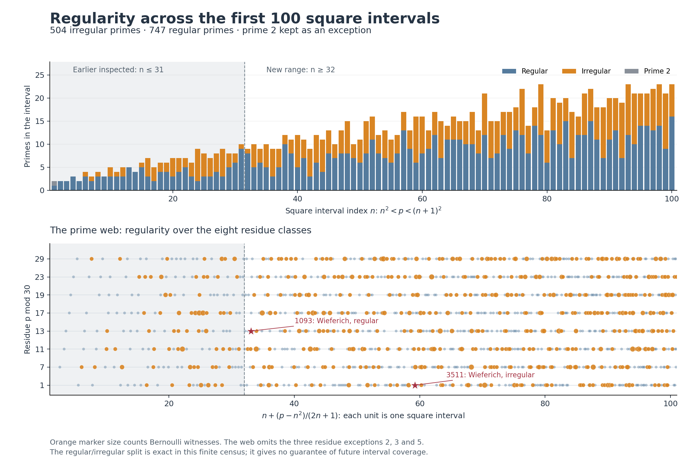
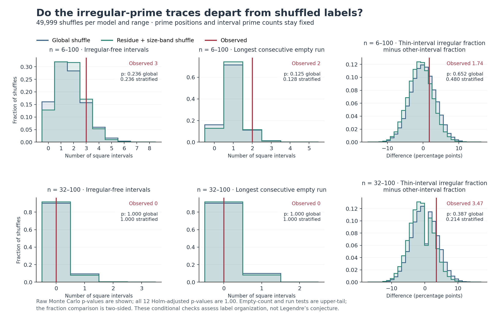

# Irregular primes in Legendre intervals

Experiment v0.1.0 · 2026-09-06 · companion to MTFT 0.26.0

## Finding

This finite census detected no departure from either conditional label-shuffle
model in the specified comparisons. The observed irregular-free intervals, their
longest run, and the regularity mix in thin intervals are all compatible with
these reference models. This does not establish independence or randomness.

Every interval from n = 15 through n = 100 contains both regular and irregular
primes. The absence of irregular-free intervals in the previously unexamined
range n = 32–100 is common under the nulls: 90.13% of global
shuffles and 91.75% of stratified shuffles also have full coverage.
It therefore supplies little evidence for an eventual irregular-prime version
of Legendre. No new prime-gap theorem is claimed.

## Exact census

The range is 1 < p < 101² = 10,201, including 1,252 primes.
Of the 1,251 odd primes, **504 are
irregular and 747 are regular**. The prime 2 is explicitly
unclassified. All 639 irregular pairs (p,k) are retained.

| Number of Bernoulli witnesses | Primes |
|---|---:|
| 0, regular | 747 |
| 1 | 385 |
| 2 | 103 |
| 3 | 16 |

There are no prime-free square intervals in this finite range. The irregular-free
interval indices are **1, 2, 3, 4, 5, 9, 13, 14**. For 2 ≤ n ≤ 100 every interval has a
regular prime. Regular and irregular classifications here are finite exact facts;
their respective infinitude statuses are properties of the families.

For an odd prime p, the full witness set is

\[
\mathcal{W}(p)=\{k\in\{2,4,\ldots,p-3\}:p\mid\operatorname{num}(B_k)\}.
\]

The empty set defines regularity. The irregular family is proved infinite;
infinitude of the regular family is open. These definitions and the known global
counting results are discussed by [Luca, Pizarro-Madariaga and Pomerance](https://math.dartmouth.edu/~carlp/irreg.pdf).
Infinitude of a family supplies no guarantee that each short interval contains
one of its members. [Chamberland and Straub](https://arxiv.org/html/2602.22502v1)
review the unresolved consecutive-square problem.

## Conditional experiments

The plan was written before calculating labels above 1,024. The earlier
conversation had already inspected the smaller census, so n = 6–100 is an
exploratory reuse of those data; n = 32–100 is reported separately. This split is
not an external preregistration and does not make the larger research program
confirmatory. The range and tests were not expanded after inspecting p-values.

Both nulls hold every prime value and every interval's prime count fixed.
The global null uniformly permutes the labels and conditions on their total.
The stratified null conditions additionally on irregular totals in each residue
modulo 30 and fixed band floor((n−6)/20). Each selected analysis range is shuffled
separately. The nulls are reference models, not established laws of prime regularity.

If a stratum contains M primes, K irregular labels, and m positions in an
interval, its exact probability of contributing no irregular prime is

\[
P_0=\frac{\binom{M-K}{m}}{\binom{M}{m}}.
\]

Multiply across strata for an interval, then sum over intervals to obtain the
expected number of irregular-free intervals. This expectation does not assume
that different intervals are independent. It is 1.7005
under the global null and 1.7279 under the
stratified null for n = 6–100; the observed count is 3.

Thin intervals are the bottom quarter of m_n/μ_n, where
μ_n = (2n+1)/log(n²+n+1/2), with ties broken by n. This definition uses no
regularity labels. The logarithmic expression is a ranking reference, not a
claimed prime-count formula for each short interval. Fractions are calculated
among primes pooled across the thin and other intervals, respectively.

| Range n | Statistic | Observed | Global central 95% null range | Global p | Stratified p |
|---|---|---:|---|---:|---:|
| 6–100 | Irregular-free intervals | 3 | [0, 4] | 0.23626 | 0.23560 |
| 6–100 | Longest run of irregular-free intervals | 2 | [0, 2] | 0.12466 | 0.12836 |
| 6–100 | Thin-minus-other irregular fraction | +1.74 percentage points | [-6.92, +7.15] pp | 0.65216 | 0.48018 |
| 32–100 | Irregular-free intervals | 0 | [0, 1] | 1.00000 | 1.00000 |
| 32–100 | Longest run of irregular-free intervals | 0 | [0, 1] | 1.00000 | 1.00000 |
| 32–100 | Thin-minus-other irregular fraction | +3.47 percentage points | [-7.21, +7.62] pp | 0.38672 | 0.21386 |

There are 49,999 shuffles in each of four scenarios, using PCG64 seeds
20260906–20260909. The tests for excess empty intervals and long runs are
upper-tail; the fraction test is two-sided around its analytic conditional
expectation. Ties are included. Monte Carlo p-values use (1 + tail count)/50,000.
**All 12 Holm-adjusted p-values are 1.00.** The plotted 95% ranges describe null
distributions; they are not confidence intervals for a population parameter.

In the new range the expected number of irregular-free intervals is only
0.1027 globally and 0.0843
under stratification. Zero observed is therefore unsurprising and the upper-tail
tests have little opportunity to detect anything without an actual empty
interval. Nonsignificance is not an equivalence test.

## Overlaps with the earlier prime families

The previously computed four prime marks reproduce exactly on the overlap.
Among odd primes in this census their intersections are:

| Additional property | Regular | Irregular |
|---|---:|---:|
| Twin members | 259 | 160 |
| Sophie Germain | 121 | 71 |
| Safe | 76 | 43 |
| Wieferich, base 2 | 1 | 1 |

These rows overlap; they must not be added as disjoint categories. In particular:

| Prime | Base-2 Wieferich | Regularity | Bernoulli witness indices |
|---:|---|---|---|
| 1093 | Yes | Regular | None |
| 3511 | Yes | Irregular | 1416, 1724 |

Thus Wieferich status alone does not determine regularity. Two examples do not
establish statistical independence. No infinitude claim is inherited by any
intersection in this table.

## Why the finite arithmetic is checkable

In the ring F_p[t]/(t^(p−2)), form
A(t) = Σ_(j=0)^(p−3) t^j/(j+1)!.
The constant term is 1, so the inverse is unique. From t/(exp(t)−1), its
coefficient of t^k is B_k/k!. All factorials required here are invertible modulo
p. Newton inversion doubles the retained degree using b ← b(2−Ab).

Every convolution uses int64 integers, with the conservative bound
(p−2)(p−1)² < 2^63−1 checked before arithmetic. No floating-point operation
enters a Bernoulli residue, witness decision, or prime count. Floating point is
used for probabilities, statistical summaries and plotting.

The saved even residues, together with B_0=1, B_1=−1/2 and the vanishing odd
Bernoulli numbers above B_1, reconstruct the full inverse. Multiplication by A
checks the entire series identity for every odd prime, including every negative
membership decision. This is a finite computational certificate, not a Lean proof.

For the separate power-sum check, Faulhaber's formula gives, for even
2 ≤ k ≤ p−3,

\[
\sum_{a=1}^{p-1}a^k \equiv pB_k\pmod{p^2}.
\]

The terms discarded modulo p² have p-adically invertible denominators in this
range. Compute the left side using modular exponentiation, verify divisibility
by p, and divide to recover B_k modulo p.

| Validation | Coverage |
|---|---:|
| Primality checked by trial division | All 10,201 integers in range |
| Complete modular inverse identities | All 1,251 odd primes |
| Comparison to exact rational Bernoulli numbers | 39,837 residues below p=1,024 |
| Separate modular-power check | All 639 positive witnesses |
| Separate modular-power negative checks | 128 sampled nonzero residues |
| Exhaustive toy null assignments | 24 |
| Prime counts partition into the two families plus prime 2 | All 100 intervals |

## What this establishes for the Legendre program

For n ≥ 2, let I_n and R_n count the two families. The identity
L_n = I_n + R_n is exact, and Legendre asks whether L_n ≥ 1 for every n.
The n=1 case is checked directly. Our shuffles condition on L_n, so they cannot
test the event L_n=0: any prime-free interval would stay prime-free in every
shuffle. Their purpose is to test whether regularity contains extra organization
within the already observed primes.

This first experiment found no detectable additional organization in its three
statistics. It supports keeping both families and their witnesses in the trace
catalogue. A useful subsequent research question would require a specified
arithmetic mechanism connecting those witnesses to interval coverage; scaling
the same census alone cannot supply a proof.

## Files and reproduction

See README.md for commands. census.npz retains every even residue with offsets;
prime_witnesses.json records every prime's full witness set. The raw Monte Carlo
statistics, exact hypergeometric probabilities, analysis plan and all scripts
are included. Validation results are in validation_results.json. SHA256SUMS.txt
binds the packaged files, and PROVENANCE.json identifies the prior census.
