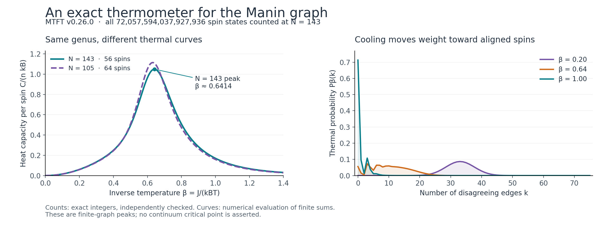
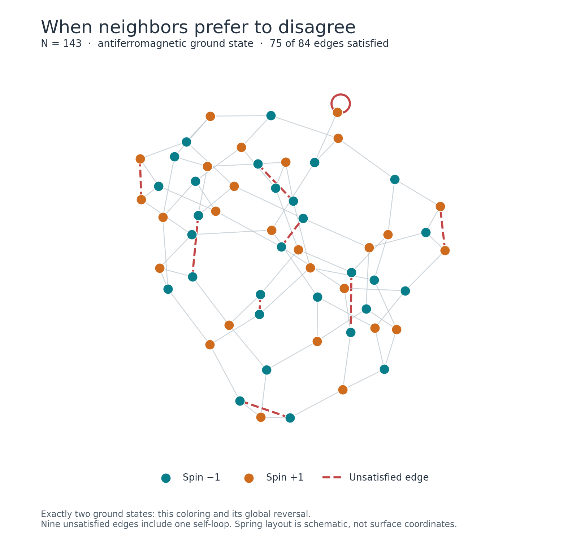

# MTFT v0.26.0: exact thermodynamics on the Manin graph

Experiment date: 2026-09-05. Source: the supplied `mtft-0.26.0.tar.gz`.

We can compute the entire zero-field Ising energy distribution of the unrefined
dual Manin graph of X₀(143) using exact integers. Its 56 spins have
72,057,594,037,927,936 configurations. A polynomial elimination calculation counted
them in 0.0115 seconds in this run, excluding graph construction and verification.
A separate C++ program enumerated every one of the graph's 536,870,912 even
subgraphs in 2.94 seconds and agreed coefficient by coefficient after the exact
cut/cycle transform.

This gives a reusable evaluator for the scalar partition function at every
temperature. It avoids evaluating the 67,108,864 spin-structure Pfaffians needed
by the release's direct genus-13 sum. It does not produce those individual
spin-structure contributions or test their parity behavior.

The method is an application of standard variable elimination / tensor
contraction, with polynomial coefficients packed into Python integers. The new
deliverable is the implementation and its checked application to these MTFT
graphs; no new general counting algorithm is claimed. Treewidth as a control on
contraction cost is established background; see
[Markov–Shi, *Simulating quantum computation by contracting tensor networks*](https://arxiv.org/abs/quant-ph/0511069).

## What the release checks established

The four targeted test files `test_surface.py`, `test_surface_qft.py`,
`test_surface_bimodule.py`, and `test_cc19_cc20.py` returned **22 passed, 1 skipped**
in 16.12 seconds (observed test outcome and timing). This is a targeted check,
not the complete package suite. The skipped test requires PARI/GP to regenerate
transport and periods; the frozen-data checks did run.

These checks cover the new Ising structural and small-level Pfaffian gates,
frozen data and block invariants, controlled Hamiltonian closure, the AF-09
doubled-space census, and the two correction regressions. The perpendicular-AL
result remains as recorded in the release: W13/W143 restore order-zero in the
tested construction, while its first-order-compatible one-forms remain zero.

## The finite model and its exact polynomial

There is one spin sᵢ ∈ {−1,+1} per Manin triangle. With unit ferromagnetic
couplings and no external field,

\[
H(s)=-\sum_{e=(u,v)}s_us_v=-E+2k(s),
\qquad
D_k=\#\{s:k(s)=k\}.
\]

Here k is the number of disagreeing edges. Edges are counted with multiplicity.
The graph includes one self-loop, whose contribution to H is always −1.
The entire partition function is therefore

\[
Z(\beta)=e^{\beta E}\sum_{k=0}^{E}D_k e^{-2\beta k}.
\]

For X₀(143), E=84 and n=56 (EXACT graph data). All Dₖ are stored as integers in
`results.json` and `density_of_states_143.csv`. Their sum is exactly 2⁵⁶. The largest
occupied k is 75; coefficients D₇₆ through D₈₄ are zero. In particular,
D₀=2 and D₇₅=2 (Cert / EXACT integer counts).

The temperature convention in the plots is β=J/(kᴮT), with J=kᴮ=1 for numerical
evaluation. Larger positive β means a colder ferromagnet. β is a physical control
parameter of the chosen spin model, not a fitted MTFT constant.

## Why the fast counting is exact

Assign each edge the polynomial factor 1 when its spins agree and x when they
disagree. Multiply all edge factors and sum over spins. This is precisely
D(x)=ΣₖDₖxᵏ.

The implementation eliminates one spin at a time. It multiplies factors that
contain that spin, sums over its two values, and keeps a factor on the remaining
neighbors. The distributive law ensures that this rearrangement preserves the
finite sum. A min-fill heuristic chooses the elimination order.

For the supplied N=143 graph the recorded order has at most ten remaining
neighbors; the largest intermediate spin table has 2¹¹=2,048 entries. This is an
EXACT certificate of the width of that order, hence an upper bound on treewidth.
It is not a proof that ten is the minimum possible width.

Instead of allocating a polynomial at every table entry, evaluate at
B=2⁵⁷. Every coefficient of every partial sum counts at most 2⁵⁶ assignments, so
it is smaller than B. Thus base-B digits never carry into adjacent polynomial
coefficients. Python's arbitrary-precision integer multiplication and addition
compute the polynomial exactly; bit shifts recover its coefficients.

The runtime advantage comes from the small intermediate factors of this graph.
It is not a general solution of hard Ising counting problems. The implementation
has an explicit width budget to avoid silently launching an impractical case.

## Independent checks

**Direct spin enumeration.** For N=6, 11, 15, 35, and 55, every coefficient Dₖ
agreed with direct enumeration of all spin configurations, through 24 spins.
This route shares the graph input but no elimination or digit-packing logic.

**Different elimination orders.** All eight studied levels were recomputed
with opposite tie-breaking. The recorded orders differ and the integer
histograms agree exactly. This tests order dependence but is not an independent
algorithm.

**Full N=143 cycle enumeration.** Let Aⱼ count even subgraphs with j occupied
edges, including the self-loop. Expanding each edge's Boltzmann factor gives

\[
Z(\beta)=2^{56}\cosh(\beta)^{84}A(\tanh\beta),
\qquad A(t)=\sum_j A_j t^j.
\]

Equivalently, the exact cut/cycle transform is

\[
A(t)=2^{-56}\sum_{k=0}^{84}D_k(1+t)^{84-k}(1-t)^k.
\]

The C++ verifier constructs a spanning tree directly from the edge list. Its
29 fundamental cycles form a binary basis of the graph cycle space. It visits
all 2²⁹ subsets in Gray-code order, counts occupied edges with bit operations,
and constructs Aⱼ without using the Python elimination algorithm. All 85
coefficients agree exactly with the transform of Dₖ. This is an independent
arithmetic check of the complete N=143 distribution, not a sample.

The beginning of the checked polynomial is

\[
A(t)=1+t+4t^3+4t^4+10t^6+18t^7+28t^8+76t^9+124t^{10}+\cdots.
\]

The t term comes from the self-loop. The total A(1)=2²⁹ differs from the
surface-homology count 2²⁶: the graph also contains the three independent
boundaries supplied by its four cusp faces.

**Other controls.** All counts respect global spin-flip parity. At infinite
temperature the exact mean disagreement count is 83/2 and its variance is 83/4.
The mean energy is consequently −1 and the energy variance is 83; the nonzero
mean is the constant self-loop term. Independent floating factor contraction
agrees with the polynomial's partition function at five positive/zero/negative
couplings, to the recorded numerical tolerance. These floating checks are not
substitutes for the exact cycle check.

The release's Pfaffian formulation follows
[Cimasoni–Reshetikhin, *Dimers on surface graphs and spin structures I*](https://arxiv.org/abs/math-ph/0608070).
The calculation here supplies a new total-partition-function reference for that
implementation at N=143. The full genus-13 Pfaffian sum itself was not run.

## What we can now explore

Thermal observables are computed from the exact counts through a stable
log-sum-exp evaluation. In particular,

\[
\frac{C}{nk_B}=\frac{\beta^2}{n}\operatorname{Var}_{\beta}(H).
\]

For N=143 the numerical heat-capacity peak is near β=0.641427, with
C/(nkᴮ)=1.048779. These are **DIAGNOSTIC numerical evaluations of an exact finite
sum**, obtained by a scan on 0.01≤β≤3 followed by local refinement. They are not
certified continuum critical data. The honeycomb reference
atanh(1/√3)≈0.658479 does not identify a singularity of this finite graph.

| N | Genus | Spins | Edges | Elimination width ≤ | Maximum cut | Max-cut configurations | Numerical β at main heat peak |
|---:|---:|---:|---:|---:|---:|---:|---:|
| 6 | 0 | 4 | 6 | 2 | 4 | 4 | 0.597362 |
| 11 | 1 | 4 | 6 | 2 | 4 | 4 | 0.597362 |
| 15 | 1 | 8 | 12 | 3 | 10 | 2 | 0.593478 |
| 35 | 3 | 16 | 24 | 5 | 20 | 18 | 0.615370 |
| 55 | 5 | 24 | 36 | 6 | 31 | 24 | 0.633598 |
| 77 | 7 | 32 | 48 | 7 | 41 | 86 | 0.625602 |
| 105 | 13 | 64 | 96 | 12 | 85 | 76 | 0.631292 |
| 143 | 13 | 56 | 84 | 10 | 75 | 2 | 0.641427 |

All integer columns are EXACT calculations on the supplied graphs; the final
column is numerical/DIAGNOSTIC. Independent full-distribution checks are as
specified above, not asserted for every large level by every method.

The same-genus comparison 105 versus 143 has different graph sizes and
connectivity, so its difference is not isolated evidence of an arithmetic effect.
There is a sharper exact control at small level: the dual graphs for N=6 and
N=11 have identical edge multisets in their current labels, despite their
surfaces having genera zero and one. Both give

\[
D(x)=2+2x+2x^2+6x^3+4x^4.
\]

Their scalar zero-field thermodynamics is identical for every β. The distinction
between these surface embeddings is not recovered by this scalar graph model.
This makes a useful negative control for future claims that a thermal observable
detects genus or arithmetic.

## Antiferromagnetic frustration: an exact ground-state picture

Switch the interaction to favor opposite neighboring spins:
H_AF=+Σₑsᵤsᵥ=84−2k. The exact largest cut is 75, so the ground-state energy is
−66 and exactly nine edges remain unsatisfied. One of the nine is the self-loop;
eight are non-loop edges. Since D₇₅=2, there is a unique ground-state coloring
up to a global spin flip (Cert / EXACT).

A separate max-plus elimination produced the displayed witness. Its 56 spin
bits and nine unsatisfied edge indices are recorded in `analysis.json`; direct
evaluation of the original edge list confirms its energy. The spring drawing
is a schematic of graph adjacency, not an embedding or metric on X₀(143).

## Scope and reusable outputs

The certified object here is the finite, unrefined, uniform-coupling,
zero-external-field graph model. The result does not establish Lorentzian
dynamics, a continuum Ising limit, arithmetic uniqueness, or nontrivial AF-09
finite differential calculus. It does not resolve individual spin structures.

Useful next work is now concrete: couple this evaluator to refinement families
when their dual graphs are available, recording elimination width before each
run; or add a second polynomial variable for magnetization so external-field
responses and susceptibility can be counted. Those extensions are not included
in the present results.

`ising_exact.py` contains the counting tool and checks. `cycle_counts.cpp` is
the independent full N=143 verifier. `analyze_results.py` generates the peak
table, max-cut witness, CSV data, and PNG/SVG figures. `README.md` provides
reproduction commands. The original source archive is included in the bundle.

Source archive SHA-256:
`758f29a7a0c2ca08896a15964b3a607c7143ac1fd335bcc8f4d84a4880e53cdf`.

This experiment used Python 3.12.13. The exact package versions and file hashes
are recorded in `provenance.json` and `SHA256SUMS.txt`. All timings are observed
single-run measurements on this runtime and exclude the stages explicitly
identified above; they are not portable performance guarantees.
