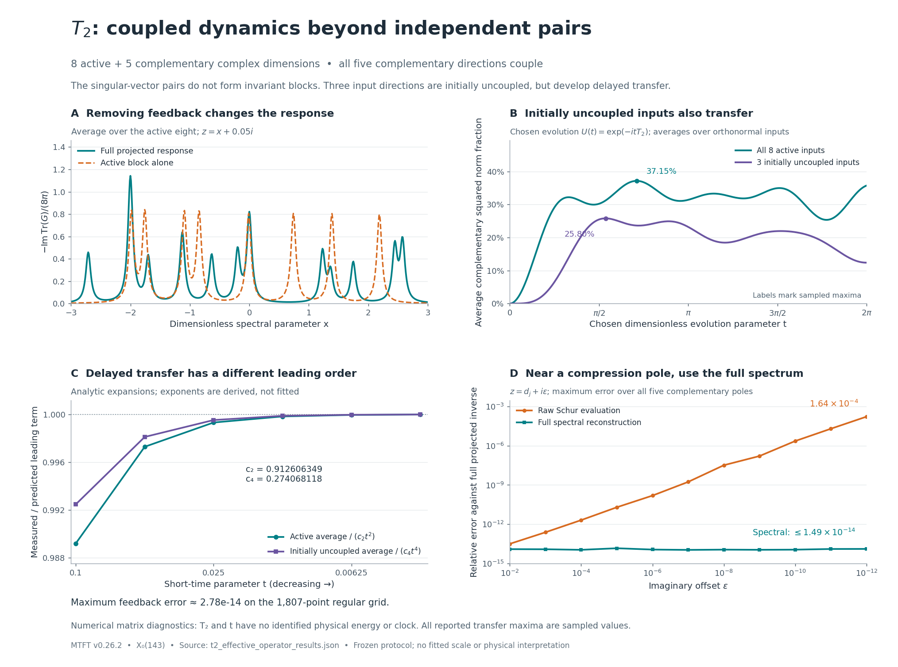

# MTFT: T2 feedback and delayed coupling

8 September 2026 · supplied MTFT 0.26.2 · companion study v0.1.0

**The feedback reduction survives without the involution identity, but the simple independent-pair structure does not.** T2 couples all five complementary complex directions to the eight-dimensional active sector. Its three initially uncoupled active directions acquire coupling at the next order of evolution.

This establishes the structure of a finite matrix reduction for the chosen MTFT subspaces. The identities used are standard operator mathematics; the measured coefficients and subspace relationships are the results specific to this experiment. Physical time, a physical Hamiltonian, particle assignments, and a Standard Model correspondence remain unidentified.

## The operator and the frozen test

We constructed a fresh `mtft.hecke.cuspidal_hecke(2)` from the unchanged supplied release, then transported it through the preceding study's frozen Hodge-orthonormal frame. We kept the same orthogonal active/complement split, of complex dimensions 8 and 5, used for W143. The active label names that previously constructed subspace; it does not assert invariance under T2.

The transported operator passed the raw adjoint and complex-linearity gates: relative real selfadjointness defect 7.40 × 10⁻¹⁵ and complex-linearity defect 7.58 × 10⁻¹⁵. A recorded Hermitian roundoff cleanup changed the complex matrix by Frobenius norm 1.58 × 10⁻¹⁴. No substantial adjoint defect was repaired, and no involution was imposed.

In orthonormal sector bases,

\[
H=T_2=\begin{pmatrix}A&B\\B^\dagger&D\end{pmatrix},
\qquad A\in\mathbb C^{8\times8},\quad D\in\mathbb C^{5\times5}.
\]

An independent exact computation on the rational arithmetic matrix gave the real26 characteristic polynomial

\[
x^2(x+2)^4
(x^4-3x^3-x^2+5x+1)^2
(x^6-10x^4+2x^3+24x^2-7x-12)^2.
\]

The numerical complex13 eigenvalues range from approximately −2.70899 to 2.57641. The many distinct eigenvalues explain why W143's two-eigenvalue shortcut is unavailable. These are arithmetic operator eigenvalues, not identified physical energies.

The local protocol was frozen before computing the new response, pole, and evolution observables. Prior evidence that T2 mixes these sectors was explicitly acknowledged as an input. The primary route used the direct complex projector; the independent route used the localization projector and full real26 eigensystem. Both inherit the same upstream Hodge geometry.

## Five coupling directions, with no independent pair decomposition

The five singular values of B are

\[
(1.9183577035,\;1.3500747922,\;0.9888337348,\;
0.9012020687,\;0.0899735945).
\]

All five are resolved under the frozen rank bands. Even the smallest, normalized by the full operator's Frobenius norm, is 0.0144073, comfortably above the 10⁻⁷ large-value threshold. The independent real-frame computation agrees on these singular values within 1.68 × 10⁻¹³.

For W143, SVD-paired directions formed invariant two-dimensional blocks. For T2, discarding the off-pair matrix entries leaves a **relative Frobenius discrepancy of 0.63168**. Individual candidate pairs have invariance residuals from 0.16828 to 0.27502 relative to the full operator norm. This is resolved coupling between pairs, far above roundoff.

The normalized commutators \([A,BB^\dagger]\) and \([D,B^\dagger B]\) have norms 0.26994 and 0.30576. An orthonormal decomposition into independent active/complement pairs, respecting the chosen sectors, would require these commutators to vanish. Thus the independent-pair picture does not describe the measured T2 matrix.

| Property of this split | W143 baseline | T2 experiment |
|---|---:|---:|
| Complex coupling rank | 2 | 5 |
| Active directions with zero initial coupling | 6 | 3 |
| Those directions remain invariant and uncoupled | Yes | No |
| Minimum exact linear auxiliary dimension for the self-energy | 2 | 5 |

The last row is conditional on the measured geometry and ranks. It concerns exact finite linear realizations of the same self-energy, keeping the active space fixed. It does not prohibit an approximation or a frequency-dependent formula with no explicitly stored auxiliary states.

## Effective response and its numerical verification

The feedback is

\[
\Sigma(z)=B(zI_5-D)^{-1}B^\dagger,
\qquad H_{\mathrm{eff}}(z)=A+\Sigma(z),
\]

\[
G_{PP}(z)=U^\dagger(zI_{13}-H)^{-1}U
=[zI_8-A-\Sigma(z)]^{-1}.
\]

Here U embeds the active basis. The Schur formula requires z outside the spectra of both H and D. The projected full resolvent itself only requires z outside the spectrum of H. This complement-invertibility condition is explicit in the standard [Feshbach–Schur construction of Dusson, Sigal and Stamm](https://arxiv.org/abs/2105.02058).

Unlike the involution case, A alone does not determine the feedback for a general Hermitian operator. Changing D while keeping A and B fixed changes Σ. The primary calculation therefore retained the actual B and D.

The regular test used 601 real coordinates from −3 to 3 at imaginary offsets 0.05, 0.2, and 0.7, plus −4, 4, 2i, and 0.17 + 0.37i. All **1,807 points** were admissible; none were skipped.

| Comparison against the primary projected full inverse | Maximum relative Frobenius error |
|---|---:|
| Schur response, including feedback | 2.7817 × 10⁻¹⁴ |
| Full-eigensystem spectral sum | 2.7218 × 10⁻¹⁴ |
| Independent real-frame/localization response | 2.6413 × 10⁻¹³ |
| Isolated active response \((zI-A)^{-1}\) | 8.3337 |

The feedback calculations pass the frozen 10⁻⁹ regular-grid gate. The baseline's maximum error is approximately **833%**, measured relative to the full projected response on this grid. It is not a global bound or a comparison at a matched physical scale with W143.

## Five memory components and five projected null directions

Diagonalizing D gives five simple compression eigenvalues. Each contributes a positive semidefinite rank-one residue \(R_j=(Bv_j)(Bv_j)^\dagger\):

\[
\Sigma(z)=\sum_{j=1}^{5}\frac{R_j}{z-d_j},
\qquad K(t)=\sum_{j=1}^{5}R_j e^{-itd_j}.
\]

| Compression eigenvalue d | Residue trace |
|---:|---:|
| −1.4113427847 | 1.3646441142 |
| −1.2950257911 | 1.3665193979 |
| 0.0886598685 | 2.9268731387 |
| 1.3309917216 | 0.7516193392 |
| 1.6599375752 | 0.8911948047 |

Their residues sum to \(BB^\dagger\) with relative discrepancy 6.71 × 10⁻¹⁶. Full column rank of B implies that the complement reachable space already has dimension five at order zero: \(\operatorname{ran}B^\dagger=\mathbb C^5\). An exact linear self-energy realization therefore needs at least five auxiliary coordinates. The high-frequency coefficient \(z\Sigma(z)\to BB^\dagger\), of rank five, supplies the same lower bound.

None of these five compression eigenvalues lies in the full spectrum. At every such d, the general identity

\[
G_{PP}(d)Bv=0\quad\text{for }Dv=dv
\]

holds. More precisely, \(\ker G_{PP}(d)=B\ker(D-dI)\). Each simple compression pole therefore gives one null direction of the projected response, while the full inverse remains regular. The measured normalized null-relation residuals are at most 1.10 × 10⁻¹⁵. This does not mean that the entire projected response matrix vanishes, and these poles are not extra full-system eigenvalues.

The 55-point stress test approached all five poles with imaginary offsets 10⁻² through 10⁻¹². Raw Schur evaluation reached relative error **1.6393 × 10⁻⁴**, with a Schur denominator condition number as large as **3.2723 × 10¹³**. The full spectral sum stayed within **1.4877 × 10⁻¹⁴** of the direct full solve. The raw Schur stress calculation does not pass the regular-grid accuracy threshold. At the real compression poles, singular complementary inversion was explicitly skipped.

## Three initially dark directions acquire delayed coupling

“Initially dark” means precisely \(B^\dagger x_0=0\): no first-order transfer to the complement. The kernel has complex dimension three. Its measured instantaneous coupling residual is 8.13 × 10⁻¹⁷ relative to the full operator norm.

It is not invariant under A. If V0 is an orthonormal basis of that kernel, the singular values of \(B^\dagger A V_0\) are

\[
(1.3678728787,\;1.1896997004,\;0.04853691845).
\]

All three are resolved. Thus, in the measured model, every nonzero initially dark input has a nonzero second-order complementary amplitude. With the explicitly chosen dimensionless evolution \(e^{-itH}\) and initially empty complement,

\[
y(t)=-\frac{t^2}{2}B^\dagger Ax_0+O(t^3),
\qquad
\|y(t)\|^2=\frac{t^4}{4}\|B^\dagger Ax_0\|^2+O(t^5).
\]

The quartic onset follows from the Taylor expansion, not a fitted exponent. The general remainder is O(t⁵); an exact complex Hermitian control confirms that an odd fifth-order term can occur.

For the uniform average over the three initially dark directions, the predicted leading coefficient is **0.2740681185**. The measured average transfer divided by t⁴ rises from 0.2720035665 at t = 0.1 to 0.2740660950 at t = 0.003125. Ordinary active average transfer divided by t² approaches its derived coefficient **0.9126063493** over the same fixed short-time sequence.

Over the 257-point grid from 0 to 2π, the largest sampled average transfer is **37.15%** across the full active sector and **25.80%** across the initially dark sector. These occur at different t values. Worst-input sampled values are 99.81% and 58.48%, respectively; these maximize over the stated input subspace at each sampled time, and do not describe one fixed input or a global-time maximum. All percentages are squared norm fractions in the chosen mathematical evolution, not physical transition predictions.

Six direct matrix-exponential controls agree with the spectral propagation and memory kernel within 6.09 × 10⁻¹⁵ for the reported residuals. The norm lost by the active amplitudes is accounted for in the complement.

## What this adds and what to test next

Eliminating the complement produces the exact equation

\[
i\dot x(t)=Ax(t)+Be^{-itD}y(0)
-i\int_0^t K(t-s)x(s)\,ds.
\]

The initial-complement forcing term vanishes only when y(0) = 0. Because B is nonzero, the projected propagator fails the composition law required of a single time-independent matrix exponential on the same eight amplitudes. Exact feedback can be represented by the memory equation or the necessary auxiliary amplitudes. This is a direct-sum amplitude projection, not a tensor-product density-matrix partial trace or a derivation of irreversible dynamics.

The useful advance is now specific: **MTFT's chosen active sector has an exact response description with five complementary memory components, and its apparent dark directions are temporary.** The simple W143 model was a tractable baseline; T2 exposes the additional coupling that a faithful reduction must retain.

The independent numerical route passes ten checks, and forty separate symbolic controls validate the general formulas on synthetic rational and complex Hermitian examples. Exact arithmetic certifies the displayed characteristic polynomial; actual Hodge geometry, numerical ranks, and measured responses remain DIAGNOSTIC. Neither the number of checks nor their small residuals is evidence of independent physical predictions.

The complete replay from the bundled archive passed all 24 execution and consistency checks. All 395 archived source files were verified byte-for-byte. The failed independent-pair description and the loss of raw Schur accuracy near poles are retained as research outcomes, separately from that replay verdict.

A useful next experiment is a **controlled approximation of this five-component memory**, with a fixed response-error budget and held-out spectral points. The smallest singular value of B suggests a possible economical approximation, but its coupling through D means that truncating it cannot be assumed reliable. That is a proposed follow-up, not a result of this run.

The accompanying bundle includes the frozen protocol, proof, primary and independent calculations, every response point, source and input hashes, scientific figure, and replay command. The release source was not edited.
