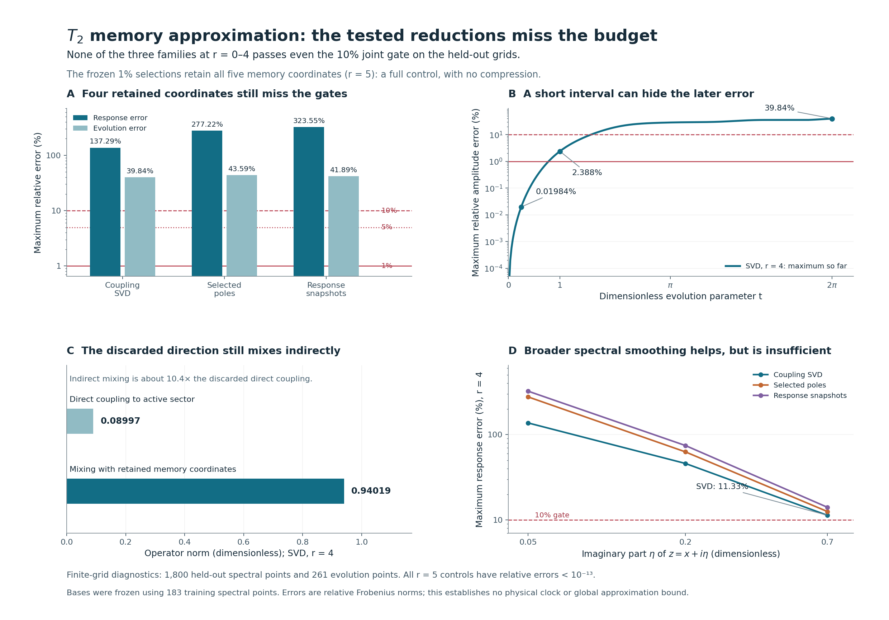

# MTFT: testing smaller T2 memory models

8 September 2026 · supplied MTFT 0.26.2 · companion experiment v0.1.0

**No compression was validated for the requested response and time domain.** Among the three prescribed approximation families, every model retaining fewer than five complementary coordinates failed the joint 1% accuracy target. The same reductions also failed the preregistered 5% and 10% tiers. Keeping all five coordinates reproduced the full model, as expected.

The result explains something useful about the preceding study: a direction with weak direct coupling can still carry substantial delayed feedback through its coupling to other memory directions. Discarding that direction can work briefly and then fail badly.

## What was fixed before looking at errors

The input was the completed T2 study's Hermitian matrix on eight active and five complementary complex dimensions,

\[
H=\begin{pmatrix}A&B\\B^\dagger&D\end{pmatrix}.
\]

We preserved A and chose r = 0 through 5 complementary directions. For an orthonormal retained basis Qr, every candidate had

\[
B_r=BQ_r,\qquad D_r=Q_r^\dagger DQ_r,
\qquad H_r=\begin{pmatrix}A&B_r\\B_r^\dagger&D_r\end{pmatrix}.
\]

This construction preserves Hermiticity and finite-system unitarity. Those structural properties do not imply approximation accuracy. The projected response still uses the standard Schur feedback construction; its complement-invertibility condition is discussed in [Dusson, Sigal and Stamm](https://arxiv.org/abs/2105.02058). All spectral evaluation points in this experiment have positive imaginary part, so the required inverses exist.

Three families were specified in advance:

| Family | Retained directions | Selection information |
|---|---|---|
| Direct-coupling SVD | Top r right singular vectors of B | B alone |
| Complementary pole subsets | r eigenvectors of D | Exhaustive subset comparison on the training grid |
| Response snapshots | Top r eigenvectors of a response Gram matrix | Uniformly weighted training response samples |

For snapshots, the Gram matrix was the mean of \(X(z)X(z)^\dagger\), with \(X(z)=(zI-D)^{-1}B^\dagger\). This is a particular prescribed snapshot rule, not a claim of optimal approximation. For pole subsets, all 32 subsets across the six ranks were scored. The best subset at each rank minimized the maximum training relative Frobenius response error, with a fixed lexicographic tie rule. The selected pole subsets need not be nested as r increases.

Training used 183 spectral points: 61 real coordinates from −3 to 3 at imaginary offsets 0.05, 0.2, and 0.7. Each family's bases and smallest training-passing rank were written and hashed before any held-out computation.

The held-out spectral grid contained 1,800 disjoint points over the same real range and imaginary offsets. Evolution was assessed at 261 prescribed dimensionless times over 0 ≤ t ≤ 2π. No time-domain errors entered model selection. This is deterministic numerical holdout using shared upstream geometry, not independent physical data.

The primary requirement was **both** maximum relative Frobenius response error ≤1% and maximum relative Frobenius active-propagator error ≤1%. The 5% and 10% tiers were secondary, fixed in advance. A model passing only at short times or only at one imaginary offset did not pass the joint requirement.

## The decision and the four-coordinate comparison

Training already selected r = 5 in every family at every budget. Those frozen selections passed the held-out checks. Since r = 5 retains the entire complement, this is a full-model control, not successful compression.

The full scan of the prescribed lower ranks also found no joint pass. Its results remain descriptive scans; no rank was chosen after viewing held-out errors and then presented as freshly validated.

The four-coordinate cases are particularly informative because they discard only one of the five memory directions:

| Four-coordinate model | Maximum held-out response error | Maximum held-out amplitude error |
|---|---:|---:|
| Direct-coupling SVD | 137.29% | 39.84% |
| Training-selected pole subset | 277.22% | 43.59% |
| Response snapshots | 323.55% | 41.89% |

These percentages use the corresponding full projected matrix's Frobenius norm as the denominator. They are not percentages of particles or lost energy. An error greater than 100% means the matrix discrepancy exceeds that reference norm at the worst sampled point.

The SVD four-coordinate model's largest response discrepancy occurred at z = −2.645 + 0.05i. For pole subsets and snapshots, it occurred at 2.315 + 0.05i and 2.275 + 0.05i, respectively. Removing a memory coordinate changes the reduced operator's spectral structure, making accurate, narrowly broadened response difficult.

Increasing broadening reduced the error, but did not rescue these models at the frozen secondary budget:

| Imaginary offset η | SVD, r = 4 | Pole subset, r = 4 | Snapshots, r = 4 |
|---|---:|---:|---:|
| 0.05 | 137.29% | 277.22% | 323.55% |
| 0.20 | 46.00% | 62.90% | 74.65% |
| 0.70 | 11.33% | 12.55% | 14.08% |

These are per-offset maxima over the held-out real coordinates. The offsets are numerical probe parameters, not measured physical linewidths. No global continuous-domain bound is inferred from this table.

The five-coordinate controls, by contrast, agree with the full response to a maximum relative discrepancy of 5.38 × 10⁻¹⁴ and with the full active propagation to 9.49 × 10⁻¹⁵ in the primary computation. Repeating these controls in three families does not create three independent physical successes.

## Why the weakest direct direction was still important

The smallest B singular value suggested that one direction might be inexpensive to remove. The SVD four-coordinate model discards a direction with direct coupling norm only **0.0899736**. However, its mixing with the retained complementary subspace through D has norm **0.940194**.

The relevant full-matrix perturbation contains both contributions. Let Qs span discarded coordinates and define

\[
B_s=BQ_s,\qquad M=Q_r^\dagger DQ_s,
\qquad C=\begin{pmatrix}B_s\\M\end{pmatrix}.
\]

In active/retained/discarded coordinates, the difference between the full operator and the reduced model with a decoupled discarded block is

\[
E=\begin{pmatrix}0&C\\C^\dagger&0\end{pmatrix},
\qquad \|E\|_2=\|C\|_2.
\]

For this SVD truncation, \(\|C\|_2=0.944489\). Judging the approximation from 0.0899736 alone misses the dominant retained/discarded mixing.

The other families remove a different balance of effects:

| Four-coordinate model | Direct discarded coupling | Retained/discarded D mixing | Full embedding error norm |
|---|---:|---:|---:|
| SVD | 0.089974 | 0.940194 | 0.944489 |
| Pole subset | 0.866960 | approximately 0 | 0.866960 |
| Snapshots | 0.810747 | 0.193683 | 0.833561 |

The pole-subset truncation eliminates mixing through D because it retains D eigenvectors, but pays for that with much larger discarded direct coupling. The snapshot model has the smallest embedding norm of these three four-coordinate examples, yet the largest worst-case response error. A conservative perturbation scale is not a ranking oracle for narrowly resolved response at specific spectral points.

## Short-time accuracy has a limited range

The SVD model does preserve the initial response well. Its prescribed time-prefix diagnostics are:

| Tested time prefix | Maximum relative active-amplitude error |
|---|---:|
| t ≤ 0.25 | 0.01984% |
| t ≤ 1 | 2.38786% |
| t ≤ 2π | 39.84443% |

Its largest discrepancy in average complementary squared-norm transfer is 5.36 percentage points over the full horizon. An average-transfer comparison is a different observable from the full active amplitude matrix; it cannot replace that matrix's error gate.

The short-time behavior follows the expansion

\[
U_{PP}(t)-U_{r,PP}(t)
=-\frac{t^2}{2}B(I-Q_rQ_r^\dagger)B^\dagger+O(t^3).
\]

A small discarded B direction therefore helps initially. It does not control all later coefficients involving D. In an exact synthetic example with **zero** direct discarded coupling but nonzero retained/discarded mixing, the active propagator discrepancy starts at \(t^4/24\). Matching the initial memory kernel can still miss later feedback.

The t ≤ 0.25 result is a preplanned diagnostic on sampled times, not a claim that the primary joint budget passed or that every continuous time in that interval has been certified. It suggests a separate short-horizon study with its own selection and error control if that becomes the intended application.

## Bounds, independent checks, and limitations

For η > 0, conditional exact algebra gives

\[
\|G(z)-G_r(z)\|_2\le\frac{\|C\|_2}{\eta^2},
\qquad
\|U_{PP}(t)-U_{r,PP}(t)\|_2\le\min(2,|t|\|C\|_2).
\]

These are absolute operator-norm bounds. They do not themselves certify a relative Frobenius percentage budget. They can be loose, especially near the real spectrum, and were recorded separately from the observed errors. The proof note also derives an optional sharper resolvent bound; that refinement changes no selection rule or gate.

An independent implementation began with the preceding full real26 operator and localization projector, reconstructed its own sector bases, and scored spectral response using Schur solves. The primary implementation used spectral decompositions. Both selected the same pole subsets and ranks without looking at each other's approximation outputs.

Across all prescribed models and points, the largest difference between their recorded relative response errors was 1.49 × 10⁻¹¹; for relative time errors it was 2.78 × 10⁻¹³. Ambient retained-subspace projectors agreed within Frobenius discrepancy 1.93 × 10⁻¹². These discrepancies are far below the tested percentage budgets and below the 10⁻⁹ cross-route tolerance. Both routes share frozen upstream geometry.

Forty-four exact symbolic controls check the Galerkin construction, embedding identities, resolvent sign, and indirect-coupling examples. Actual T2 ranks, coefficients, and error measurements remain floating-point DIAGNOSTIC. The exact five-state realization lower bound does not imply that every conceivable four-state approximation must fail a finite-grid budget. This experiment rules out the tested candidates for the stated domain and norms.

The complete replay passed all 24 execution and consistency checks. That verdict confirms reproducibility, phase separation, cross-route agreement, and identity controls; it does not turn the failed compression budgets into successful approximations.

There is no fitted energy scale, physical Hamiltonian identification, tensor-product partial trace, irreversible limit, or Standard Model assignment here. No runtime speedup is claimed: the task measured accuracy, and the full matrix is already small.

The practical conclusion is to **retain all five complementary directions for this full-domain response target**. If a smaller approximation is pursued, the next study should target a specified short horizon or observable, with a fresh error budget and independent assessment. The present results show precisely why a weak instantaneous coupling is insufficient grounds for deletion.

The bundle includes the frozen protocol, training-selection records, all held-out errors, both implementations, exact proof controls, figures, input extracts and their parent provenance, and a replay command. The MTFT release source was unchanged.
