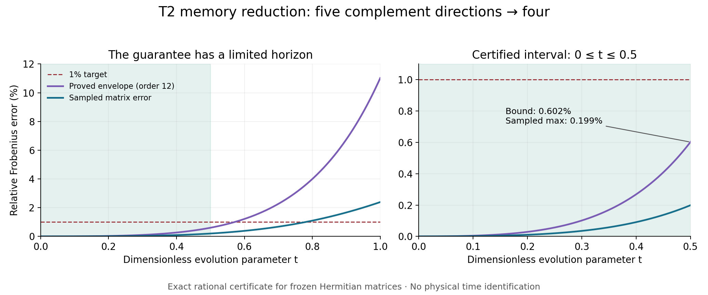

# T2 short-horizon reduction: a proved error budget

Study v0.1.0 · 2026-09-08 · MTFT 0.26.2 research lineage

**The fixed four-direction complement model meets a 1% relative Frobenius
active-propagator error budget throughout 0<=t<=0.5.** The exact rational
calculation bounds the error by 0.601907%, while the sampled maximum is 0.198611%.
This is a theorem about the explicitly frozen finite Hermitian matrices. It
does not certify the original numerical period geometry or identify physical
time. The half-unit horizon is the largest of the five listed horizons that
obtained a certificate; it is not claimed to be the optimal possible horizon.

## Why this experiment follows the previous result

The parent study tested three structure-preserving reduction families. Every
model below five complement directions failed the registered joint
spectral/time targets, even at the 10% budget. The four-direction B-SVD model
was interesting because its error stayed small briefly: 0.01984% through
t=0.25, growing to 2.38786% through t=1 and 39.8444% through 2pi. Its full
spectral-grid error reached 137.285%.

The discarded direction couples weakly directly, with norm 0.08997, but its
mixing with retained complement directions has norm 0.94019. That feedback
explains why a small instantaneous singular value did not support a global
approximation. Here we retain that same subspace and ask a narrower question:
can its useful interval be bounded continuously?

This follow-up was motivated by those known outcomes. The fixed protocol is
not described as blinded selection. It lists horizons 1/8,1/4,1/2,3/4,1 and
orders 4, 6, 8, 10, 12 before the new calculations. An independent mathematical
review supplied a sharper unitary remainder before evaluation; the protocol
records that amendment. No subspace, threshold, or horizon was fitted to the
new measured error.

## The model and error being bounded

From the parent inputs, form the explicit block-coordinate matrices

\[
H=\begin{pmatrix}A&B\\B^*&D\end{pmatrix},\qquad
H_r=\begin{pmatrix}A&BQ\\(BQ)^*&\mathrm{herm}(Q^*DQ)\end{pmatrix}.
\]

Their sizes are 13 and 12, with the first eight coordinates active; Q is the
parent's fixed 5x4 B-SVD basis. Both stored matrices are exactly Hermitian
when their floating components are interpreted as dyadic rationals. We
certify these stored matrices directly. In particular, we do not pretend
the original floating Hodge frame or Q has exact orthogonality.

The error is

\[
e(t)=\frac{\|[e^{-itH}]_{aa}-[e^{-itH_r}]_{aa}\|_F}
{\|[e^{-itH}]_{aa}\|_F}.
\]

It compares active amplitude propagator matrices, with initially zero
complement amplitude. It is not a density-matrix partial trace, a worst-input
relative-error guarantee, or a probability error. The total matrix size falls
from 13 to 12; this study measures accuracy, not a runtime speedup.

## Continuous bounds and measured values

All bounds below use the strongest recorded order, 12, and cover every real
t in[0,T]. The sampled maxima use a 1001-point grid on[0,1].

| Horizon T | Proved uniform error bound | Sampled maximum |1% certificate |
|---:|---:|---:|:---|
|0.125|0.007684%|0.002970%|Pass|
|0.25|0.056601%|0.019836%|Pass|
|0.5|0.601907%|0.198611%|Pass|
|0.75|3.025661%|0.867253%|Inconclusive|
|1|11.021493%|2.387865%|No; sampled error also exceeds1%|

The 0.75 case illustrates the distinction: our bound cannot certify 1%, but
the sampled errors do not exceed 1%. We have neither established nor refuted
a continuous 1% guarantee there. The exact rational certificate stores all 25
order/horizon combinations, including the looser row-norm remainder.

## What makes the bound rigorous

Let M_k=(H^k)aa-(H_r^k)aa. The two zeroth and first moments agree exactly.
Taylor's integral remainder for Hermitian matrices uses unitary evolution,
so no exponential growth factor is required. With E and E_r selecting active
columns, for all |t|<=T the absolute Frobenius error is at most

\[
N_m(T)=\sum_{k=0}^m\frac{T^k\|M_k\|_F}{k!}
+\frac{T^{m+1}}{(m+1)!}
(\|H^{m+1}E\|_F+\|H_r^{m+1}E_r\|_F).
\]

The complement has dimension 5 and the active space dimension 8. Unitarity
therefore forces at least three singular values of the full active block
to equal 1, implying its Frobenius norm is at least sqrt(3). Hence
e(t)<=N_m(T)/sqrt(3).

The code encodes entries as integer real/imaginary matrices divided by a
power of 2, computes powers using exact integers, and encloses square roots
outwards with rationals. The final comparison with 1/100 is exact.
SHORT_HORIZON_IDENTITIES.md contains the proof. BOUND_CERTIFICATE.json
contains the reproducible rational values, input hashes, and decisions.

## Verification

- Dependency-free exact replay reproduces all 25 certificate rows.
- An independent implementation uses SymPy's Gaussian rational matrices,
  verifies 14 coefficient enclosures and 25 active-column tail/bound rows,
  and proves the decisive 0.5/order12 inequality with a different square-root
  enclosure: N^2<=3/10000.
- Independent 80-digit evaluation agrees with the displayed bound.
- Twelve exact symbolic toy identities cover direct complex coupling,
  delayed coupling, and zero coupling; 161 independent sampled checks
  confirm the numerical behavior and denominator.
- Six direct matrix-exponential controls agree with the main spectral
  evaluation to at most 3.90e-15 in Frobenius norm. The stored finite models
  reconstruct exactly on the recorded runtime from the parent inputs.
- Invalid-input controls reject non-Hermitian matrices and invalid bound
  parameters. Strict integer intake also rejects floating and Boolean JSON
  entries rather than silently truncating them.

The independent toy verifier initially compared an unsimplified symbolic
expression structurally; simplifying the difference resolved that false
mismatch. This was a verifier-expression repair, not a changed mathematical
hypothesis or discarded observation. RUN_NOTES.md records implementation
hardening and the provenance chain.

## Integration decision

Keep all five complement directions as the reference for the previously
registered spectral and long-interval targets. Make the four-direction model
available as a research example with a declared short horizon and error
metric. The reusable contribution is the exact finite-matrix bound machinery,
the proof, and the replayable fixture; no public API change is assumed.

The interval cannot be repeatedly restarted to obtain an arbitrary long-time
guarantee: compressed propagation generally fails the semigroup identity
because the complement stores amplitude. A stepwise reset would be a new
model requiring a separate bound. Further improvements could tighten the
denominator or bound the full signed Taylor polynomial, but no such result
is claimed here.
