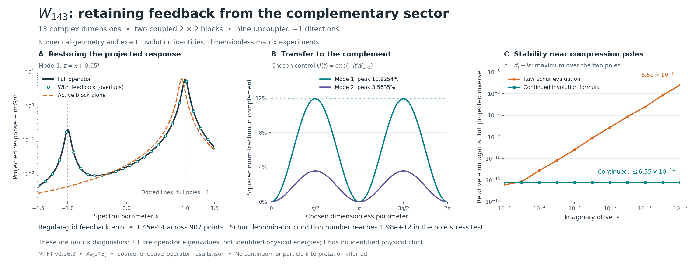

# MTFT: the effective operator for W143

8 September 2026 · supplied MTFT 0.26.2 · companion experiment v0.1.0

**The active-sector response can be recovered while retaining feedback from the complementary sector.** On the frozen 907-point grid, the resolvent reconstructed from the effective operator agrees with the projected full resolvent to a maximum relative Frobenius error of **1.45 × 10⁻¹⁴**. Treating the active compression as an isolated operator instead gives errors up to **90.7%** on that same grid.

This is a finite operator result. The experiment establishes a useful reduction of the supplied arithmetic operator; it does not identify a physical Hamiltonian, particle spectrum, spacetime signature, or Standard Model interaction.

## What was reduced

We retained the preceding study's orthogonal splitting into an eight-dimensional complex active sector and a five-dimensional complex complement. Here “active” names the previously constructed subspace, rather than a sector proved to be invariant under every arithmetic operator. W143 was freshly loaded from the supplied package and transported into the frozen Hodge-orthonormal frame.

In orthonormal sector bases, write

\[
W=W_{143}=\begin{pmatrix}A&B\\B^\dagger&D\end{pmatrix},
\qquad A\in\mathbb C^{8\times8},\quad D\in\mathbb C^{5\times5}.
\]

The coupling B has numerical complex rank two under the frozen two-tier rank rule. Its two singular directions give the following coupled blocks:

\[
W_j=\begin{pmatrix}a_j&b_j\\b_j&-a_j\end{pmatrix},
\qquad a_j^2+b_j^2=1.
\]

| Coupled channel | Active diagonal a | Coupling b | Complement diagonal −a | Principal angle |
|---|---:|---:|---:|---:|
| 1 | 0.938480710580 | 0.345331660681 | −0.938480710580 | 10.101021° |
| 2 | 0.982020812699 | 0.188772676587 | −0.982020812699 | 5.440584° |

Each channel contains one active and one complementary complex direction. The coupled part therefore has **four complex dimensions**. Six other active directions and three other complementary directions are uncoupled and carry eigenvalue −1. The full operator still acts on thirteen complex dimensions, with eigenvalue multiplicities +1: two and −1: eleven.

The primary route used an SVD of B. The independent route used the positive eigenspace of W and the earlier localization construction of the active projector. If ρ is an eigenvalue of the active projector compressed to that positive eigenspace, then

\[
a=2\rho-1,\qquad b=2\sqrt{\rho(1-\rho)}.
\]

The two routes agree on b within 2 × 10⁻¹⁴. The primary canonical reconstruction residual is 2.22 × 10⁻¹⁴; the independent route's maximum geometry residual is 7.15 × 10⁻¹⁴. These are independent computations with shared upstream geometric inputs, not independent experimental data.

## The feedback formula

Eliminating the complementary variables gives

\[
\Sigma(z)=B(zI_5-D)^{-1}B^\dagger,
\qquad H_{\mathrm{eff}}(z)=A+\Sigma(z),
\]

\[
G_{PP}(z)=U^\dagger(zI_{13}-W)^{-1}U
=[zI_8-H_{\mathrm{eff}}(z)]^{-1},
\]

where U embeds the active basis. The first inverse requires z outside the spectrum of D; the resolvent equality also requires z outside the spectrum of W. This is the standard Feshbach–Schur construction, including its complement-invertibility condition. See [Dusson, Sigal and Stamm, Theorem 1.2 and equations (1.15)–(1.16)](https://arxiv.org/abs/2105.02058).

W143 is an involution. Consequently the projected resolvent also has the closed form

\[
\boxed{G_{PP}(z)=\frac{zI_8+A}{z^2-1},\qquad z\ne\pm1.}
\]

This reveals a useful distinction: A, together with the global involution identity, contains enough information to reconstruct the projected response. The incorrect baseline is using \((zI_8-A)^{-1}\), which treats A as an isolated generator and omits feedback. We are not claiming that A itself discards all information about the complement. Indeed, \(BB^\dagger=I_8-A^2\), and wherever the displayed inverses exist,

\[
\Sigma(z)=(I_8-A^2)(zI_8+A)^{-1}.
\]

The regular grid was fixed in advance: 301 equally spaced real coordinates from −1.5 to 1.5, at imaginary offsets 0.05, 0.2, and 0.7, plus z = −2, 0, 2, and i. All 907 points were evaluated without adjusting the grid or coefficients.

| Comparison against the projected full inverse | Maximum relative Frobenius error |
|---|---:|
| Direct Schur formula with feedback | 1.4452 × 10⁻¹⁴ |
| Closed involution formula | 2.3509 × 10⁻¹⁴ |
| Isolated active compression | 0.90738 |

Both feedback-preserving evaluations pass the registered 10⁻⁹ regular-grid gate. The largest baseline error occurs at z = 0.94 + 0.05i. This is a maximum on the specified grid, not a certified error bound over all spectral parameters.

## Apparent poles and numerical stability

In a coupled channel,

\[
H_{\mathrm{eff},j}(z)=a_j+\frac{b_j^2}{z+a_j},
\qquad G_{PP,j}(z)=\frac{z+a_j}{z^2-1}.
\]

At z = −a_j, the effective operator has a pole, but that channel's projected full response has a **zero**. The full operator's eigenvalues remain ±1. Eliminating variables has introduced a singular representation, not an extra eigenstate.

The registered conditioning stress test approached each of the two interior eigenvalues of D with imaginary offsets 10⁻² through 10⁻¹², for 22 points. Its results must be distinguished from the regular-grid gate:

| Pole stress diagnostic | Observed maximum |
|---|---:|
| Direct Schur/full relative error | 6.5923 × 10⁻⁵ |
| Continued involution/full relative error | 6.5429 × 10⁻¹⁴ |
| Schur denominator condition number | 1.9822 × 10¹² |

The raw Schur computation **does not retain 10⁻⁹ accuracy throughout this stress test**. Near a compression pole it forms a very large feedback term and an ill-conditioned denominator. The closed involution formula avoids that unstable intermediate calculation.

At the two real compression poles, the code deliberately skips inversion of zI−D. Direct full solves and the closed formula remain finite; the relevant channel responses have absolute magnitudes 3.57 × 10⁻¹⁴ and 4.34 × 10⁻¹⁵, consistent with their algebraic zeros. These interior poles are separate from the genuine full-system poles at ±1.

The data also retain a threshold-based numerical rank estimate for Σ. Such a relative threshold can lose a smaller singular value when the leading value diverges near a compression pole. That numerical conditioning effect is not a change in the algebraic coupling rank.

## A controlled example of memory and norm exchange

To test the same reduction dynamically, we chose the dimensionless mathematical evolution \(e^{-itW}\). This t has no identified physical clock or conversion to seconds. For initial data entirely in the active sector,

\[
x(t)=(\cos t\,I_8-i\sin t\,A)x(0),
\qquad y(t)=-i\sin t\,B^\dagger x(0).
\]

For a normalized input in channel j, the squared norm in the complement is \(b_j^2\sin^2t\). It reaches **11.9254%** in channel 1 and **3.5635%** in channel 2. Those are mathematical norm fractions for this chosen evolution, not measured or predicted particle transition probabilities. The return to zero at t = π follows automatically from W² = I.

Six direct matrix-exponential checks validate the projected trigonometric formula to a maximum Frobenius residual of 2.08 × 10⁻¹⁴ and the norm-balance identity to 5.03 × 10⁻¹⁵. The plotted curves use 257 points over 0 ≤ t ≤ 2π.

Eliminating y produces an exact memory equation:

\[
i\dot x(t)=Ax(t)+Be^{-itD}y(0)
-i\int_0^t K(t-s)x(s)\,ds,
\qquad K(t)=Be^{-itD}B^\dagger=e^{itA}(I_8-A^2).
\]

The initial-complement forcing term disappears only when y(0) = 0. Furthermore,

\[
U_{PP}(t)U_{PP}(s)-U_{PP}(t+s)=\sin t\sin s\,BB^\dagger.
\]

Because B is nonzero, no time-independent matrix generator on the same eight active amplitudes can reproduce this projected evolution at every time. The memory term, or retained complementary variables, is essential. This is projection onto a direct-sum sector; no tensor-product environment or density-matrix partial trace was constructed.

## Evidence and next research point

The package's integer W143 satisfies W143² = I exactly, and its positive projector has exact real rank four. A separate symbolic control verifies 27 identities for a generic canonical two-dimensional channel. Ten checks pass in the independent canonical construction. The accompanying proof explains the domains and initial-state conditions for all reduction identities.

The measured coefficients and subspaces remain float64/complex128 diagnostics inherited from the frozen Hodge geometry. Before using the complex operator, the experiment gates selfadjointness, complex linearity, involutivity, and the projector identities. It then removes an anti-Hermitian roundoff component of Frobenius size 7.96 × 10⁻¹⁵; it does not project the operator onto an exact involution. No Lie-closure gate is used or altered. The supplied MTFT release source is unchanged.

The complete packaged replay passed all 18 consistency checks and verified all 395 archived source files byte-for-byte. These checks validate execution and agreement of the stated constructions; their count is not a count of independent physical predictions.

W143 gives a tractable baseline precisely because its involution identity constrains the answer so strongly. **The next useful extension is the same reduction for T2**, after checking the required adjoint and sector conventions. That experiment would test which response and memory features survive without W143's two-eigenvalue simplification. It is a proposed follow-up, not a result of this run.

The bundle includes the frozen protocol, all pointwise results, both canonical constructions, symbolic checks, proof, figure code, frozen inputs, source archive, and a replay command. The outcome is a validated finite reduction and a numerical stability lesson; a physical interpretation would require additional structure and independent tests.
